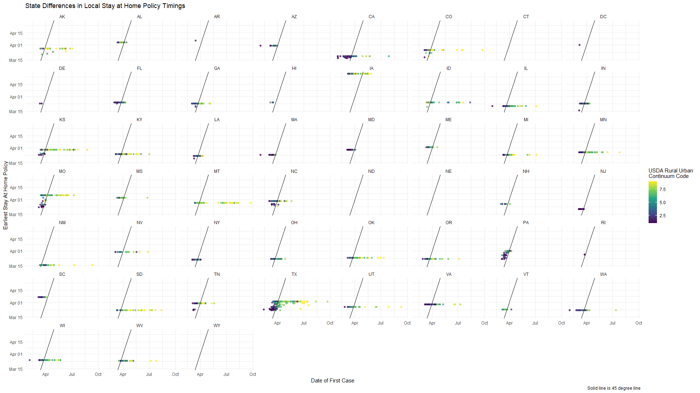
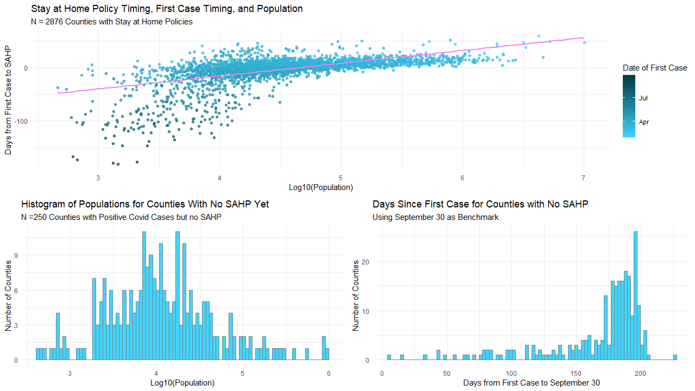

# Luke Chen's Portfolio of Assorted Visualizations and Code

## Visuals Examining Covid-19 Stay-at-Home Policy (SAHP) Timing

This figure uses data from the [CDC](https://data.cdc.gov/Policy-Surveillance/U-S-State-Territorial-and-County-Stay-At-Home-Orde/qz3x-mf9n), [Wright, Chawla, Chen, Farmer \(2020\)](https://papers.ssrn.com/sol3/papers.cfm?abstract_id=3667149) and [New York Times](https://github.com/nytimes/covid-19-data) to visually represent geographic variation in key timings: the enactment of SAHPs, mask mandates, and first Covid-19 case. From the visualization, we can see:
1. SAHPs tend to be enacted at the state-level with relatively little variation among counties within a given state, except for a few exceptions.
1. Mask mandate policies are comparatively more localized and tend to be enacted in more urban, populous, and politically liberal areas.
1. Covid-19 tends to hit counties that include or border metropolitan areas much earlier than more rural, less populous counties.

The intuitions from the maps above is elaborated on in this figure. Using the USDA's [2013 Rural-Urban Continuum Codes](https://www.ers.usda.gov/data-products/rural-urban-continuum-codes/), I plot the first case dates against SAHP dates for the counties in each state to suggest policies tend to be enacted in response to the advent of Covid-19 cases among urban counties and that few states show any evidence of preemptively enacting policies. This hints at the strong endogeneity of policy timing and policy shocks and motivating the need to rigorously analyse the determinants of policy timing prior to conducting event study analysis of policy effects.

In this plot, I show an apparent positive relationship between population and delay between the first Covid-19 case and policy action in a county. However, the main point of this plot is actually to highlight the potential for erroneously identifying a positive relationship between population and later policy timings. Simply by nature of how Covid-19 policy-making occurs in most states, urban counties will demonstrate a ``slower" or less sensitive policy response to Covid-19 than rural counties in the same state. Further confounding this matter is the fact that most of the states that never adopted SAHPs tend to be the more rural counties. If we were to treat observations with no SAHP yet as having very delayed policies, then the positive relationship would disappear or even invert.

One implication of this quirk is that, when comparing counties conditional on event time, the observed differences in behavioral change (i.e. reduction of mobility) may be negatively biased. Specifically, negative bias arises if agents voluntarily undertake behavioral changes in response to Covid-19 cases. That is, if agents engage in voluntary stay-at-home behavior, then the policy will be binding to a smaller portion of the population. Given the fact that urban populations tend to experience Covid earlier, and that policies tend to be decided at the state level, conditioning on event time will result in the comparison of policy effects across different sub-populations. For more urban counties, the policy effect will be measured only on the sub-population that had not yet engaged in voluntary behavior change while in rural counties, the same effect will be measured based on a greater representation of the population. It is also important to note that this problem cannot be easily solved by simply adding a control for the amount of time that has passed since the first case as this will introduce large amounts of multicollinearity into the model.
